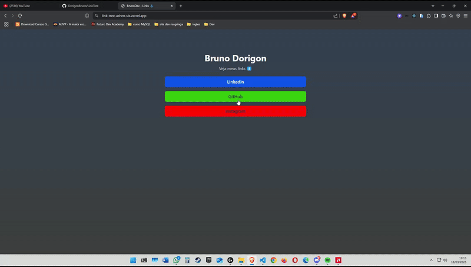

  

# Projeto LinkTree 🌲

Projeto basicamente é um CRUD, faz login com email e senha, e conecta com o banco de dados do firebase.

O projeto consiste em cadastrar os links dinâmicamente no banco dados, tanto cadastrar como excluir, e mostrar na tela tanto na home como admin.

# Tecnologias - 👨‍💻

- React
- TypeSCript
- FireBase
- TailwindCss
- React Router Dom
- Vite
- React icons
- React toastfy
- Git
